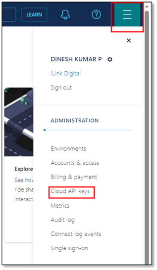
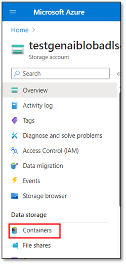
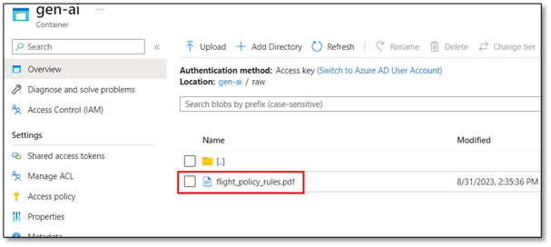

# Data Generation - Manual

## Contents

1. Prerequisites.

2. Azure and Confluent Environment Setup for Data Generation.

3. Generate and Process Data to the Confluent Topics.
4. Confluent Environment Manual Setup
5. Rockset Setup and Confluent Integration
6. Flink Statement Execution

### Prerequisites

1. Azure Subscription.

2. Azure OpenAI

3. Rockset DB

4. Confluent Cloud Account.

5. Git Bash: If not installed, [download here](https://git-scm.com/downloads).

6. Required CLIs: Make sure that you have the following CLIs installed on your computer:

    - Terraform CLI - [Download here](https://developer.hashicorp.com/terraform/downloads)
    - Confluent CLI - [Download here](https://docs.confluent.io/confluent-cli/current/install.html)
    - Azure CLI - [Download here](https://learn.microsoft.com/en-us/cli/azure/install-azure-cli-linux?pivots=apt)
    - Azure Function CLI - [Download here](https://learn.microsoft.com/en-us/azure/azure-functions/functions-run-local?tabs=windows%2Cisolated-process%2Cnode-v4%2Cpython-v2%2Chttp-trigger%2Ccontainer-apps&pivots=programming-language-csharp)

7. Python: Make sure you have the latest version of Python installed. If not, [download here](https://www.python.org/downloads/release/python-390/).

### Azure and Confluent Environment Setup for Data Generation

1. Download the “DataGen_Terraform” from the Git repository.

2. Generate Confluent “Cloud API keys” as follows.

**Note:**
- You should have the “OrganizationAdmin” role to do this step.

2.1. Login to your **Confluent account**.

2.2	Click the **three bars** at the top right corner of the home page.

2.3	Click the **Cloud API keys**.

2.4 Click the **Create key**.

2.5	Choose **Global access** and click **Next**.

2.6	Click **Download and continue** to save the Cloud API keys to your local computer.

3. Navigate to the “DataGen_Terraform” folder downloaded in step 1.

4.	Open “variable.tf” file in Notepad++ or Visual Studio Code.

**Note:**
- This file contains Confluent Cloud API and secret information, along with unique names for Confluent and Azure resources to be created using these names. 
  
- It's essential to ensure these names remain unique within both your Confluent and Azure environments, preventing any duplication with other resource names. 
  
- You can modify Azure and Confluent resource names if needed, but ensure they remain distinct from existing or new resource names.

5.	Replace default values for "confluent_cloud_api_key" and "confluent_cloud_api_secret" with the keys downloaded in Step 2.6.

6.	Open **Git Bash**.

7.	Enter `az login` to log in to your Azure account. A new popup will appear. Follow the instructions in the popup to sign in.

8.	Enter `az account set --subscription xxxxxxxxx` to set the Azure subscription you want to use. Replace "xxxxxxxxx" with your Azure subscription. 

9.	Enter `pip install azure-functions` to install the data generation functions.

10.	Navigate to the “DataGen_Terraform” folder.

**Note:**
This command might differ based on the location of “DataGen_Terraform” folder in your local computer.

11.	Enter `sh Create_Components.sh` to create the complete azure and confluent environment for data generation.

**Note:**
This process may take approximately 15 minutes, so please wait.

12.	Log in to your **Azure portal**.

13.	Navigate to the Resource Group and Go to the storage account “testgenaiblobadls” that was created.

**Note:**
If you changed Azure resource names in "variable.tf," the blob container name might be different.

14.	Select **Containers**.

15.	Click **gen-ai** container.

16.	Select the **raw** directory.

17.	Upload the `flight_policy_data` pdf file to the “raw” directory. 

### Generate and Process Data to the Confluent Topics

1.	Open **Git Bash**.

2.	Enter `sh DataGen_Trigger.sh` to trigger and send flight itineraries, passenger data, gate information and policy data to the Confluent topics "FlightItinerariesData," "FlightCustomerData," "FlightGateData," and "FlightPolicyData," respectively.

## Create Confluent Topics in Confluent Cloud Cluster (Manual Confluent Setup)

1. Login to Confluent Cloud - <https://confluent.cloud/home>

2. Go to **Environments** tab from left option pane, select **default**
    Environment.

3. If Cluster is not already present, click on the **Add Cluster**
    button.

4. Choose the type of Cluster to deploy and click on **Begin
    configuration.**

5.  Select Cloud Provider, Region and Availability Zone for basic
    cluster and click on Continue.

6.  Click on the **Launch cluster** button.

7.  Select the launched cluster and then click on **Topics** option from
    left option pane.

8.  Click on the **Add Topic** button.

9.  Enter topic name and partitions as **1**, click on **Create with
    defaults**. Create 7 topics in same manner for topic names mentioned
    below.

    i.  FlightCustomerData

    ii. FlightGateData

    iii. FlightPolicyData

    iv. FlightItineriesData

    v.  FlightDataConsolidatedEmbeddings

    vi. Questions

    vii. Answers

### Rockset Setup and Confluent Integration

1.  Sign up to create account on - <https://rockset.com/>

2.  Select Integration option from left option pane.

3.  Click on the **Add Integration** button.

4.  Select Confluent Cloud from External Service panel list and click on
    **start** button.

5.  Add Integration name which can be random use case specific text and
    other cluster information which can be gathered from confluent cloud
    cluster. Required information can be generated / received as shown
    below.

    i.  Bootstrap server URL is present in confluent cloud cluster's
        cluster setting option.

ii. API KEY and API Secret can be created from API key option from
    confluent cloud cluster's left option pane in the cluster.

iii. Schema registry URL is present in the environment. Once environment
     is selected, in the right option pane schema registry can be URL
     can be found.

iv. API Key and Secret for schema registry can be created from option
    present as **credentials** just below it's URL in right option pane.

1.  Click on **Save Integration**.

2.  Select Collections from left pane option to create collections for
    confluent cloud topics and click on **create collections** button.

3.  Select **confluent cloud** from the data sources list.

4.  Select created Integration and click on the start button.

5.  We need to create 3 collections exactly as shown below.

    i.  FlightData collection

        -   Fill out details exactly as shown below. Kafka topic
            'FlightData', Starting offset 'Earliest', Data Format
            'AVRO'. Click on the **next** button.

-   Click on the **next** button on the second step as well.

-   Add collection name as **'FlightData'** and Data compression option
    'LZ4' from dropdown. Select the **create** button.

ii. FlightPolicy collection

    -   Follow exactly same steps as of 'FlightData collection' except
        Kafka topic name to be 'FlightDataConsolidatedEmbeddings', Data
        format as 'Json' in first step.

    -   In the 3rd step, add collection name as '**FlightPolicy'** and
        change compression dropdown to 'LZ4'.

    -   Click on the **create** button.

iii. FlightCode collection

     -   This collection needs to be created with the CSV file present
         in repo under datagen directiory, named as
         "Flight_Data_lookup.csv"

     -   Click on the **create collection** button.

     -   Select **file upload** option from **sample data** section of
         data sources.

     -   Click on the **start** button.

     -   Choose File format as CSV and click on hyperlink Choose file.
         Select file mentioned above from local file system.

-   Click on the **next** button on the second step.

-   On the third step of collection creation, name collection as
    'FlighCode' and change compression dropdown to 'LZ4'.

-   Click on the **create** button.

### Flink Statement Execution:

1.  Login into confluent cloud and click on the newly created
    environment.

2.  Inside the environment you could able to see flink tab and Click on.

3.  In Flink tab you can see Flink compute pool, Flink statements and
    API Keys.

4.  Select on API keys tab and click on add api key

5.  Select My access and click next

6.  Select cloud region (same as cluster and Flink cloud region) and
    click next

7.  Provide name to the API key along with the description for which
    it's been used and select create API key

8.  Make note of the Account ID which starts with "U-", Download the key
    and save and Click on complete

9.  Navigate to `DataGen/Terraform/Flink folder`.

10. Open variable.tf file

11. Enter the following values.

-   cloud_api_key = confluent_cloud_api_key

-   cloud_api_secret = confluent_cloud_api_secret

-   organization_id = confluent_organisation_id

-   environment_id = Confluent environment ID -- ex \"env-w153z5\"

-   flink_compute_pool_id = Flink compute pool ID -- ex \"lfcp-rvy2x1\"

-   flink_rest_endpoint = \"https://flink.{cloud region}.{cloud
    provider}.confluent.cloud\"

-   flink_api_key = use the API key which you created for Flink

-   flink_api_secret = use the API secret which you created for Flink

-   flink_principal_id = Account ID for ex \"u-g9r0ov\"

12. run flink.sh to execute the flink statements.
