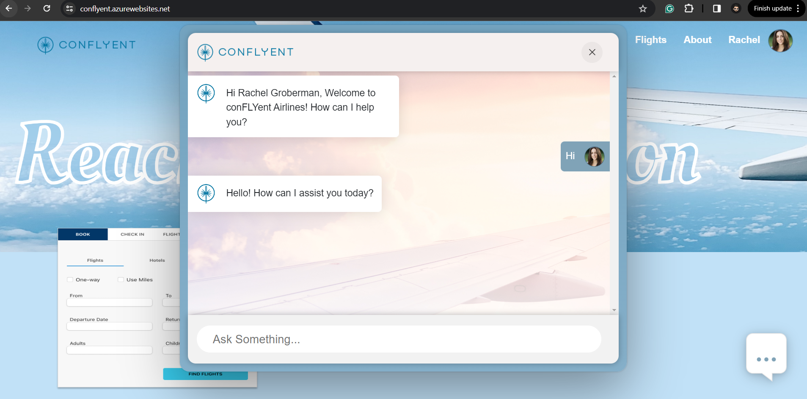

# Docker Deployment - Manual


## Frontend

- Frontend consists of React web app, Node JS Socket server code and Docker file.

- Docker image is build using the Docker file and pushed to Azure container registry.

- From Azure container registry the Docker image is deployed to Azure web App.

## Backend

- Backend consists of consumer group LLM and Docker file.

- Docker image is build using the Docker file and pushed to Azure container registry.

- From Azure container registry the Docker image is deployed to Azure container App.

### Perquisites

- Docker - Download and install Docker Desktop <https://www.docker.com/products/docker-desktop/>
- Active Azure Subscription
- Any code editor

### Components

- Azure Container Registry
- Azure Web App
- Container Apps

### Azure container registry

Step1 - login to azure portal

Step2 - Click on create new resource and search for azure container
registry.


Step3 - Click on create Container Registry

Step4 - Fill in the required details.

- Subscription - Select the Subscription from drop down which you want to use.

- Resource group - Select the RG from the drop down or create a new RG.

- Registry name - Enter the name of the container registry.

- Location - Select the location from drop down which you want to use.

- Pricing plan - Select the plan from drop down.


Step4 - Ones all detailed are filled click on Review and create.

### Building Docker image for Frontend and pushing to Azure container registry

Step1 - Clone/Download the code from repository.

Step2 - Navigate to the folder where the code downloaded/cloned.

Step3 - Open the code using code editor for example VS code. You will
be able to see two folders Frontend and Backend.

Step4 - Navigate to Frontend Folder

Step5 - Open new terminal and select bash from VS code.

Step6 - To build docker image.

`````bash
docker build -t {container registry login server}/{image name}:{image tag} path/to/docker/file
`````

- container registry login server - will be the login server of Azure container registry (for ex. confluentgenai.azurecr.io).
- image name - name of the docker image (for ex. Frontend).
- image tag - docker image tag (for ex. latest).


````bash
for example - "docker build -t confluentgenai.azurecr.io/Frontend:latest ."
````

Step7 - We need to authenticate with Azure.

````bash
az login
````

Step8 - we need to authenticate Azure container registry.

```bash
az acr login --name <acrName>
```

```bash
for example - az acr login --name confluentgenai.azurecr.io
```

Step9 - To push docker image to Azure container registry.

````bash
docker push {container registry login server}/{image name}:{image tag}"
````

````bash
For example - "docker push osktoccmigration.azurecr.io/Frontend:latest"
````

### Building Docker image for Backend and pushing to Azure container registry

Step10 - Navigate to Backend Folder

Step11 - To build and push backedn docker image to Azure container registry follow Step6 to Step9.

Step10 - Ones the Docker image is built and pushed to ACR go to Azure portal and open the Azure container registry.

Step11 - Navigate to Reposistroy tab you will be able to see the pushed
docker images.


### Azure Container App

Step1 - login to azure portal.

Step2 - Click on create new resource and search for Container app.


Step3 - Click on create.

Step4 - Fill in the required details.

- Subscription - Select the Subscription from drop down which you want to use.

- Resource group - Select the RG from the drop down or create a new RG.

- Container app name - Enter Container App name.

- Region - Select the Region from drop down which you want to use.

- Container Apps Environment - create new or use one from the drop down.


- Click next to container tab.

**In Container tab**

- Name - Name of the container App.

- Image source - Azure Container Registry

- Registry - Select the container registry from drop down.

- Image - Select the image name from drop down.

- Image tag - Select the image tag from drop down.

- Workload profile - Consumption - upto 4vCPUs, 8Gib Memory (existing config)

- Cpu and Memory - 1.75 CPU cores, 3.5 Gi Memory (existing config)

- Review and create.

- Ones deployment completed go to the resource.


### Azure web app

Step1 -- login to azure portal

Step2 -- Click on create new resource and search for web app.


Step3 - Click on create new web app.

Step4 - Fill in the required details.

- Subscription - Select the Subscription from drop down which you
    want to use.

- Resource group - Select the RG from the drop down or create a new
    RG.

- Instance name - Enter the name web App name.

- Publish - select Docker Container

- Operating system - Linux

- Region - Select the Region from drop down which you want to use.

- Pricing plan -- Select the plan from drop down or create a new plan.

- Click next and leave database to default and click next to Docker
    tab


**In Docker tab**

- Select Options as Single container.

- Image Source as Azure Container Registry

- Registry - name of the container registry

- Image - name of the docker image

- Tag - docker image tag.

- Leave the remaining tabs to default and click on review and create.


Step5 - wait for the deployment to complete and go to the created web
app.

Step6 - Now Click on the Domain url to access the web app.


Now you can interact with the chat bot.


