# Terraform Execution

By using terraform we are going to perform the following:

* Creation of Azure resources - Resource Group, ADLS blob, Function Apps, Container Registry, Container App and Web App.
* Creation of Confluent components - Enviroment, Cluster, Topics, Flink and Sink connector.
* Creation of DataGenration.
* Building Docker images for Frontend and Backend.
* Deploying Docker images to Container App(backend) and Web App(frontend).

## Prerequisites

1. Azure Subscription - [Azure](https://login.microsoftonline.com/organizations/oauth2/v2.0/authorize?redirect_uri=https%3A%2F%2Fportal.azure.com%2Fsignin%2Findex%2F&response_type=code%20id_token&scope=https%3A%2F%2Fmanagement.core.windows.net%2F%2Fuser_impersonation%20openid%20email%20profile&state=OpenIdConnect.AuthenticationProperties%3DHPEEzac0V84qgOTMN71ECQXxMpI5m2FqIsZ-WGWDnOrVbvpAZ3nA7huBPSk54q8UZl65nY_0rXcwOPE2MQz10cVA0PKtRLxkEER5kQ0GhZ82JuCPVt-TQdNnFpB2UO9_nQls0WPDr1R8pGE5veCZZhs9Qe5LOqQE6sY7ZEQEhYb2P0jZY_9PHvmapjpBr1_Uc8IMx6aamUMuv6sCNYhbLksp4Vw0q6foVQUSwULnWByh72Y-aacPjqRgdVFZkKVKnOa9ShbjZkJ7CtMHENAIICevhI5JDjKR86HJJKhA-9jiprU3mmnTbaU9cPcPMGsKtvAwxqt2SlZD47IBhu7_iEQmdHxA8Dy7fP4OR6tAbyiCt6UWuyVheC95EeFFYwNAOpfv1Ko2UFbOoe3Qjytb7uhHRPmncA9T69aI3suOzSlq1Lp6mE-xgCDhqxLJfFgQ_xqCDpnZ-F7vofAlwizxv3NWFb-AUaxyZwnuEF44mQsXdzPUKcK3YT62lU9O2Rvp&response_mode=form_post&nonce=638518086607887006.MWZiZjczMjMtN2Y2Ny00MTc0LThiZjMtMDAwMzMzMGM4MTViMmI4YTY0M2QtNDE0Mi00ZGMyLThhN2EtNzc1MTViNTc1NDFk&client_id=c44b4083-3bb0-49c1-b47d-974e53cbdf3c&site_id=501430&client-request-id=3e5a8f3e-366a-421f-85ee-4d6064ba4daa&x-client-SKU=ID_NET472&x-client-ver=7.2.0.0)
2. Confluent Cloud Account - [Confluent](https://www.confluent.io/confluent-cloud/?utm_medium=sem&utm_source=google&utm_campaign=ch.sem_br.brand_tp.prs_tgt.confluent-brand_mt.xct_rgn.india_lng.eng_dv.all_con.confluent-cloud&utm_term=confluent%20cloud&creative=&device=c&placement=&gad_source=1&gclid=Cj0KCQjw6auyBhDzARIsALIo6v9nBsrMlcVCFKuY5PZMkHOQ_ocpZVg9ORL-fbMQvl1Atmis7Cv2JG4aArKIEALw_wcB)
3. Rockset Account - [Rocketset](https://rockset.com/?utm_medium=paid&utm_source=google&utm_campaign=Brand_search&utm_term=rockset&utm_medium=ppc&utm_campaign=GAds-Search-Brand-US&utm_source=adwords&hsa_acc=7255809193&hsa_grp=150144081033&hsa_tgt=kwd-301988738617&hsa_src=g&hsa_ad=697473817567&hsa_mt=e&hsa_kw=rockset&hsa_net=adwords&hsa_ver=3&hsa_cam=16123169211&gad_source=1&gclid=Cj0KCQjw6auyBhDzARIsALIo6v-Q7ZTTnWnY6g6ufVM1OOznId2QBNfPXQhNiB_eqppFyJZpTZ5EXksaAgWLEALw_wcB)
4. Aure Open AI - Refere [Azure_OpenAI](Azure_OpenAI.md)
5. Terraform - [Download here](https://developer.hashicorp.com/terraform/install)
6. Azure CLI - [Download here](https://learn.microsoft.com/en-us/cli/azure/install-azure-cli)
7. Docker    - [Download here](https://www.docker.com/products/docker-desktop/)
8. Azure Function CLI - [Download here](https://learn.microsoft.com/en-us/azure/azure-functions/functions-run-local?tabs=windows%2Cisolated-process%2Cnode-v4%2Cpython-v2%2Chttp-trigger%2Ccontainer-apps&pivots=programming-language-csharp)
9. Python - Make sure you have the  Python 3.10 version installed. If not, [download here](https://www.python.org/downloads/release/python-390/)
10. Git Bash - If not installed, [download here](https://git-scm.com/downloads)
11. Any code editor - [VS code](https://code.visualstudio.com/)

**Note:** Kindly make sure all the prerequisites are Created/Installed.

### Source Code

**Step1:** To Clone/Download the source code from the Git repository, click on `code` icon


**Step2:** In dropdown you can see options to download the code as zip or clone the repositroy.

**Step3:** Navigate to the path where the code is downloaded/cloned.


**Step4:** We are going to deploy each blocks in the below order

1. DataGen
2. FrontEnd
3. BackEnd

### Confluent Cloud API keys Generation

**Note:**  You should have the “OrganizationAdmin” role to do this step.

**Step1:** Login to your **Confluent account**.

**Step2:**	Click the **three bars** at the top right corner of the home page.

**Step3:**	Click the **Cloud API keys**.

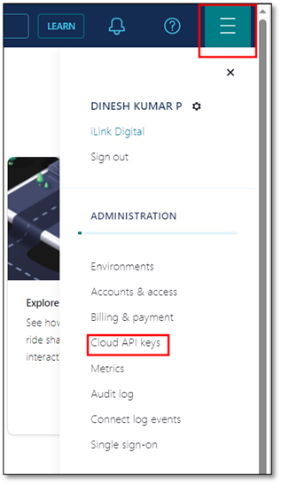

**Step4:** Click the **Create key**.

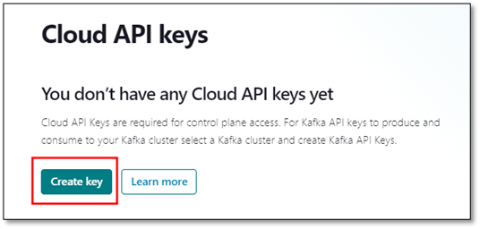

**Step5:**	Choose **Global access** and click **Next**.

**Step6:**	Click **Download and continue** to save the Cloud API keys to your local computer.

## DataGen

**Step1:** Open new Bash terminal using VScode or GitBash

**Step2:** To authenticate with Azure run the below command.

````bash
az login
````


**Note**: New window will open, kindly enter valid azure login credentials to authenticate

**Step3:** To set the Azure subscription you want to use. Replace "xxxxxxxxx" with your Azure subscription ID.

````bash
az account set --subscription xxxxxxxxx
````

**Step4:** Navigate to the `DataGen -> terrform -> Azure_and_Confluent -> variable.tf`.


**Step5:** Open `Variable.tf` file and enter the required values.

**Note:**

* This file contains Confluent Cloud API and secret information, along with unique names for Confluent and Azure resources to be created using these names.
  
* It's essential to ensure these names remain unique within both your Confluent and Azure environments, preventing any duplication with other resource names.
  
* You can modify Azure and Confluent resource names if needed, but ensure they remain distinct from existing or new resource names.

**Step6:** Run `Create_Components.sh` – to create the azure and confluent components.Ones `Create_Components.sh` completed, login to Azure and Confluent to view the newly created components.

**Step7:** We need Place the `flight_policy_data.pdf` in the raw folder of the newly created blob container.

1. Login to Azure portal and Navigate to `subscription -> Resource Group -> Blog storage` and Select **Containers**.

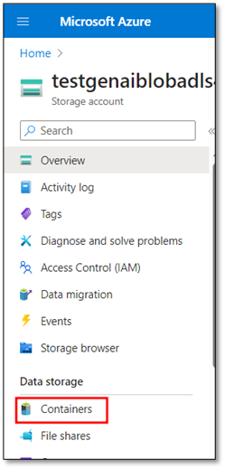

2. Click **gen-ai** container.

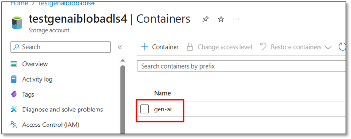

3. Select the **raw** directory.

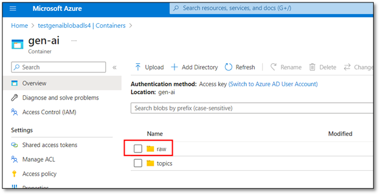

4. Click on Upload to Upload the `flight_policy_data` pdf file to the “raw” directory.

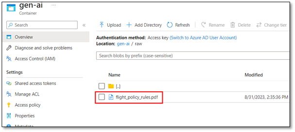

**Step8:** Navigate to `DataGen -> terrform -> Azure_and_Confluent` and open **properties.txt** which will be created after running `Create_Components.sh`

**Step9:** Update the `CONFLUENT_SCHEMA_REGISTRYURL` and `CONFLUENT_SCHEMA_REGISTRY_AUTH_USER` vaules. `CONFLUENT_SCHEMA_REGISTRY_AUTH_USER` is converted as `basic.auth.user.info` in DataGen_Trigger.sh script.

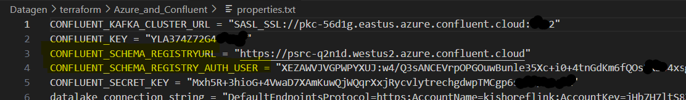

1. Schema registry URL is present in the environment. Once environment
is selected, in the right option pane schema registry can be URL
can be found.

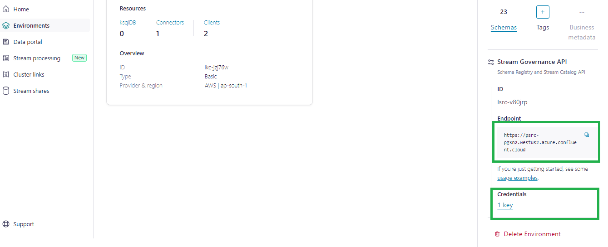

2. API Key and Secret for schema registry can be created from option
present as credentials just below it's URL in right option pane.

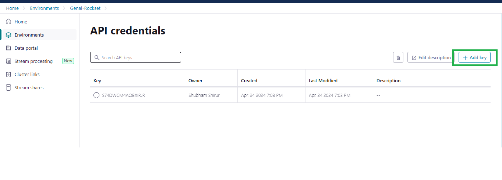

**Step10:** Run `DataGen_Trigger.sh` – to push Data into confluent topics.

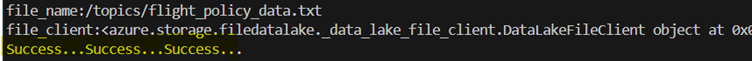

**Step11:** To create flink API key and secret

1. Login into confluent cloud and click on the newly created environment.

2. Inside the environment you could able to see flink tab and Click on.

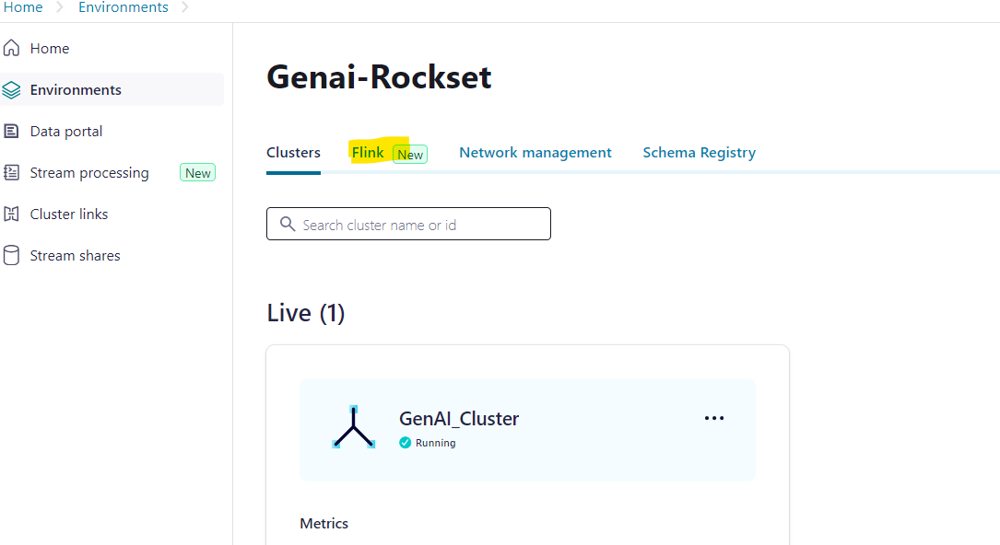

3. In Flink tab you can see Flink compute pool, Flink statements and API Keys.

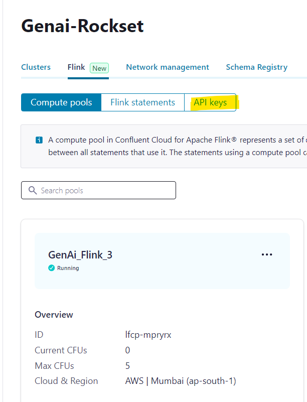

4. Select on API keys tab and click on add api key

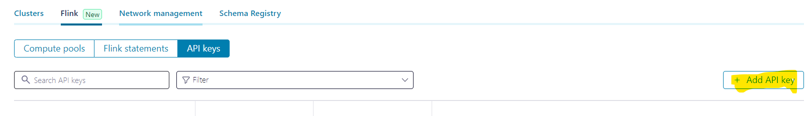

5. Select My access and click next

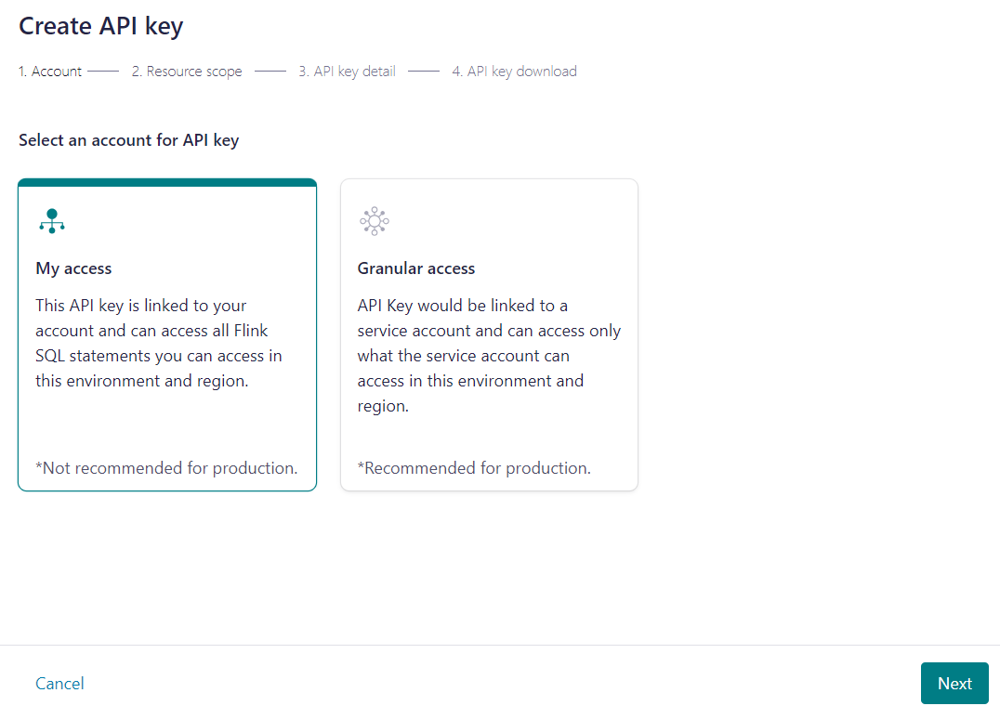

6. Select cloud as **Azure** and cloud region as **virginia(eastus)** and click next

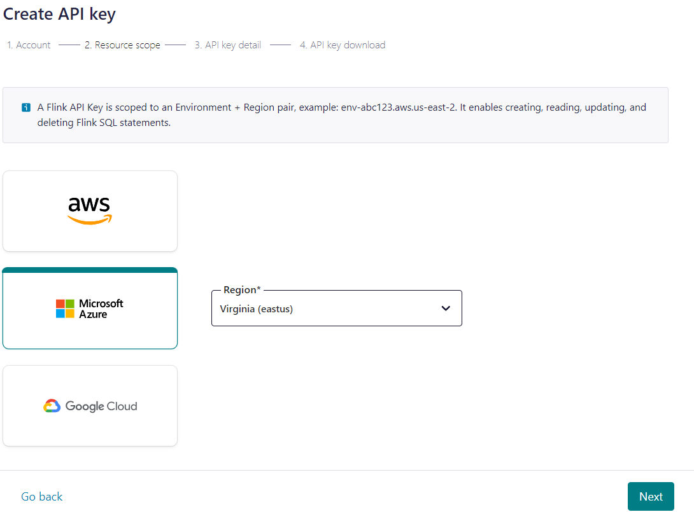

7. Provide name to the API key along with the description for which it's been used and select create API key

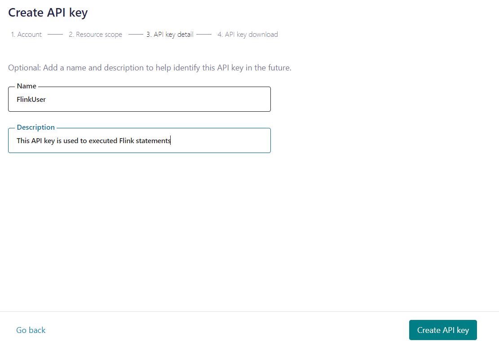

8. Make note of the Account ID which starts with "U-", Download the key and save and Click on complete

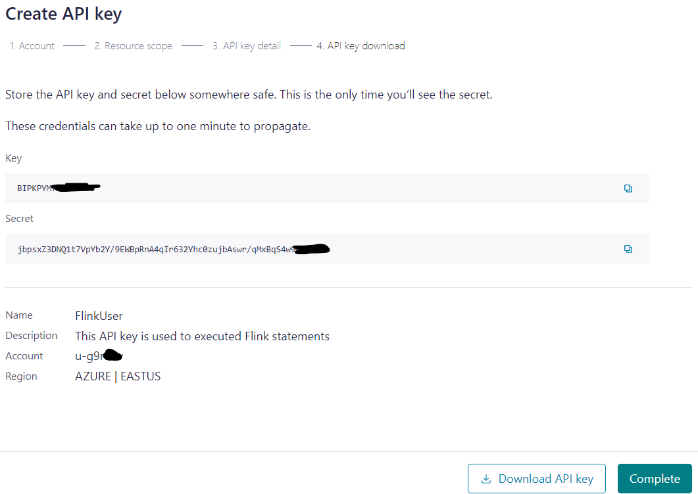

**Step12:** Navigate back to the `DataGen` folder and open `Kafka.py` and enter the OpenAI details from lines 15 - 18.


**Step13:** Navigate to the `DataGen -> terrform -> Flink` folder.

**Step14:** open `variable.tf` file and enter the requried values.

-   cloud_api_key = confluent_cloud_api_key

-   cloud_api_secret = confluent_cloud_api_secret

-   organization_id = confluent_organisation_id

-   environment_id = Confluent environment ID -- ex \"env-w153z5\"

-   flink_compute_pool_id = Flink compute pool ID -- ex \"lfcp-rvy2x1\"

-   flink_rest_endpoint = \"https://flink.eastus.azure.confluent.cloud\"

-   flink_api_key = use the API key which you created for Flink

-   flink_api_secret = use the API secret which you created for Flink

-   flink_principal_id = Account ID for ex \"u-g9r0ov\"

**Step14:** Run `flink.sh` to execute the flink statements and push data into embeddings topic.

### Rockset Setup and Confluent Integration

**Step1:**  Login to Rockset account - <https://rockset.com/>

**Step2:**  Select Integration option from left option pane.

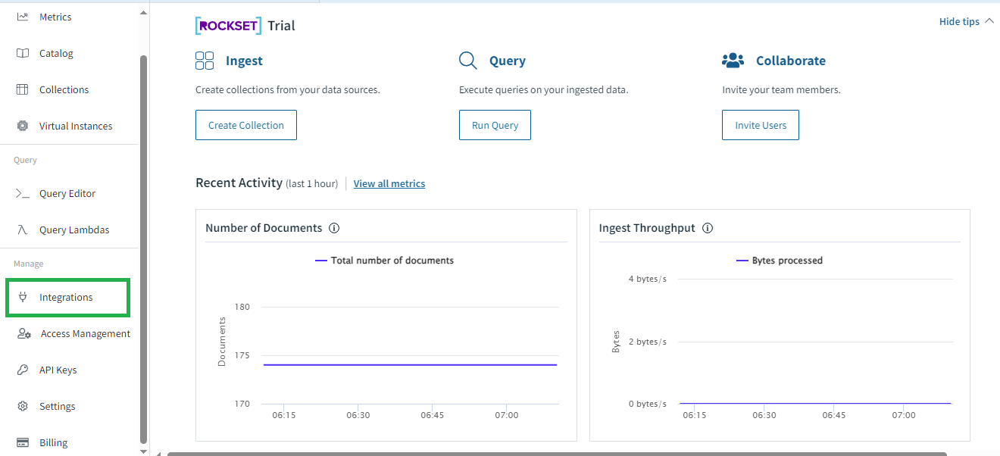

**Step3:**  Click on the **Add Integration** button.

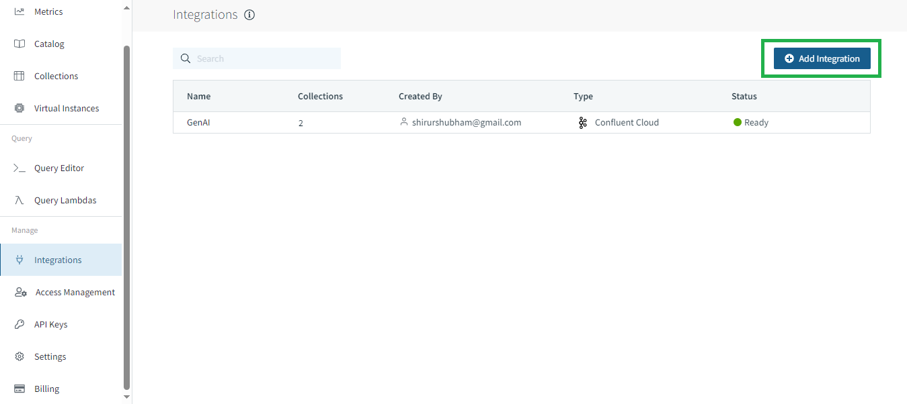

**Step4:**  Select Confluent Cloud from External Service panel list and click on **start** button.

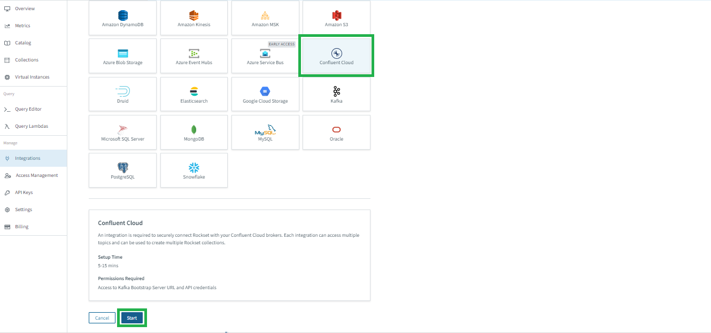

**Step5:**  Add Integration name which can be random use case specific text and other cluster information which can be gathered from confluent cloud cluster. Required information can be generated / received as shown below.

Refer **properties.txt** files values from the path `DataGen -> terrform -> Azure_and_Confluent` for creating the intergation.

1. Bootstrap server URL is present in confluent cloud cluster's, cluster setting option.

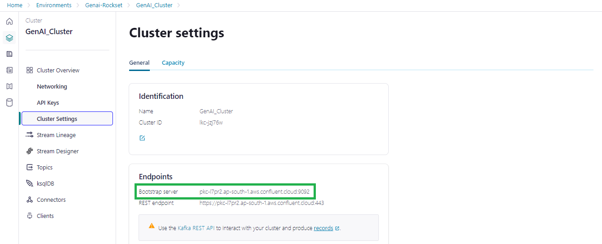

2. API KEY and API Secret can be created from API key option from confluent cloud cluster's left option pane in the cluster.

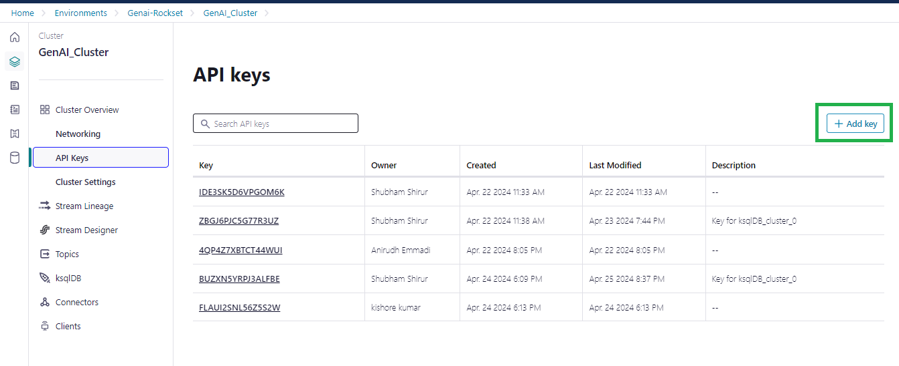

3. Schema registry URL is present in the environment. Once environment is selected, in the right option pane schema registry can be URL can be found.


4. API Key and Secret for schema registry can be created from option present as **credentials** just below it's URL in right option pane.


**Step6:**  Click on **Save Integration**.

**Step7:**  Select Collections from left pane option to create collections for
    confluent cloud topics and click on **create collections** button.

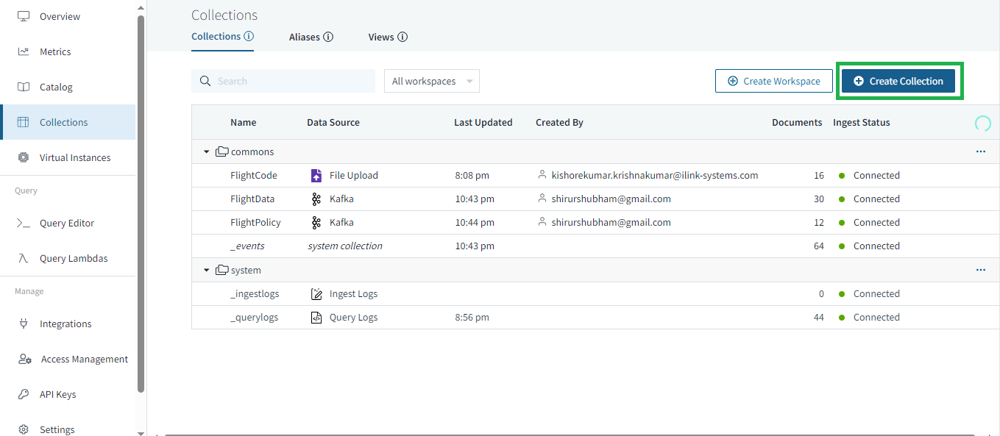

**Step8:**  Select **confluent cloud** from the data sources list.

**Step9:**  Select created Integration and click on the start button.

**Step10:**  We need to create 3 collections exactly as shown below.

1. **FlightData collection:**

* Fill out details exactly as shown below. Kafka topic `FlightData`, Starting offset `Earliest`, Data Format `AVRO`. Click on the **next** button.

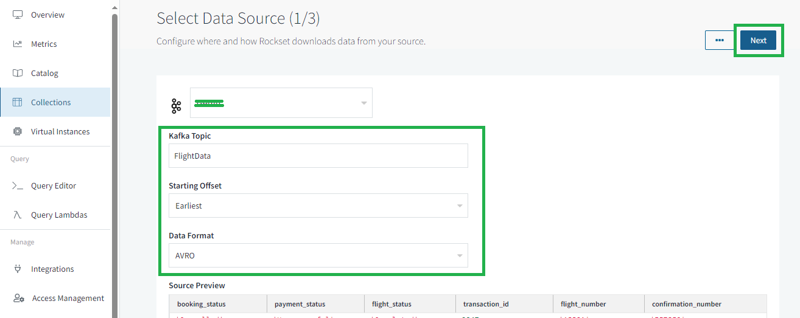

* Click on the **next** button on the second step as well.

* Add collection name as **'FlightData'** and Data compression option 'LZ4' from dropdown. Select the **create** button.

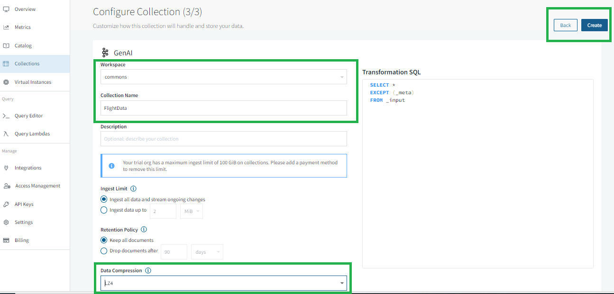

2. **FlightPolicy collection:**

* Follow exactly same steps as of `FlightData collection` except Kafka topic name to be `FlightDataConsolidatedEmbeddings`, Data format as `Json` in first step.

* In the 3rd step, add collection name as '**FlightPolicy'** and change compression dropdown to `LZ4`.

* Click on the **create** button.

3. **FlightCode collection:**

* This collection needs to be created with the CSV file present in repo under datagen directiory, named as **Flight_Data_lookup.csv**

* Click on the **create collection** button.

* Select **file upload** option from **sample data** section of data sources.

* Click on the **start** button.

* Choose File format as CSV and click on hyperlink Choose file. Select file mentioned above from local file system.

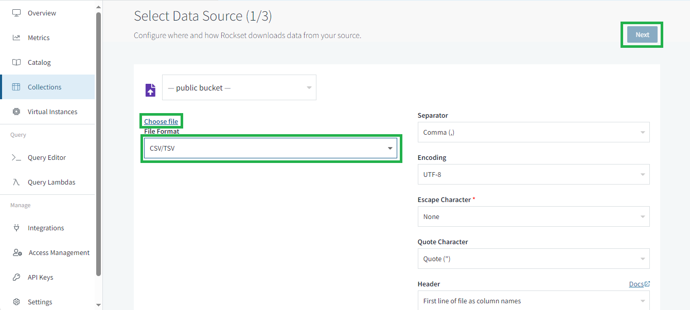

* Click on the **next** button on the second step.

* On the third step of collection creation, name collection as `FlighCode` and change compression dropdown to `LZ4`.

* Click on the **create** button.

**Step11:** To create Rockset API, select **API KEYS** from manage and click on create API key

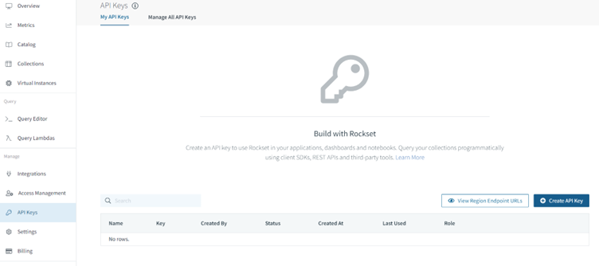

**Step12:** Provide name the API key and select the **ADMIN** role and click submit.

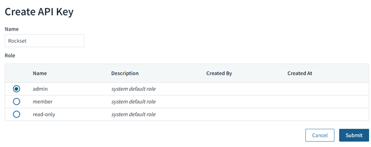

**Step13:** copy and save the API key. we will be using this API key during backend deployment.

### FrontEnd

**Step1:** Navigate to `FrontEnd -> terrform -> variable.tf`

**Step2:** Open `Variable.tf` file and enter the required values. Use the same resource group name used for DataGen.

**Step3:** Run `Frontend_deploy.sh` – To create azure components and deploy frontend.

### BackEnd

**Step1:** Navigate to `BackEnd -> chat_app -> client.properties`

**Step2:** Open `client.properties` and update the confluent cluster details. Refer **properties.txt** files values from the path `DataGen -> terrform -> Azure_and_Confluent`

- bootstrap.servers=CONFLUENT CLUSTER BOOTSTRAP SERVER
- security.protocol=SASL_SSL
- sasl.mechanisms=PLAIN
- sasl.username=CONFLUENT CLUSTER API KEY
- sasl.password=CONFLUENT CLUSTER API SECRET

**Step3:** Navigate to `config.py` and update the Rockset and OpenAI details.

**Rockset DB configuration**

- ROCKSET_API_KEY = "Rockset api key"
- ROCKSET_API_SERVER = for example - "https://api.use1a1.rockset.com"

do not change the topics name

- FLIGHT_COLLECTION = "FlightData"
- POLICY_COLLECTION = "FlightPolicy"
- LOOKUP_COLLECTION = "FlightCode"

**Azure OpenAI configuration**

- AZURE_OPENAI_API_KEY = "open AI api key"
- AZURE_OPENAI_ENDPOINT = for example - "https://idochatgpt.openai.azure.com/"
- AZURE_OPENAI_CHAT_DEPLOYMENT_NAME = "chatllm16k"
- AZURE_OPENAI_EMBEDDINGS_DEPLOYMENT_NAME = "idocembedd"
- AZURE_OPENAI_API_VERSION = "2024-02-15-preview"

**Step4:** Navigate to `BackEnd -> terrform -> variable.tf`

**Step5:** Open `Variable.tf` file and enter the required values. Use the same resource group name and Azure container registry name used in FrontEnd.

**Step6:** Run `Backend_deploy.sh` –To create azure components and deploy Backend.

**Step7** once the Backend_deploy.sh script completed, go back to Azure protal  `subscription -> Resource Group -> Web App` and Select the web app you have created.

**Step8** Click on the Default domain url to launch the chat app.

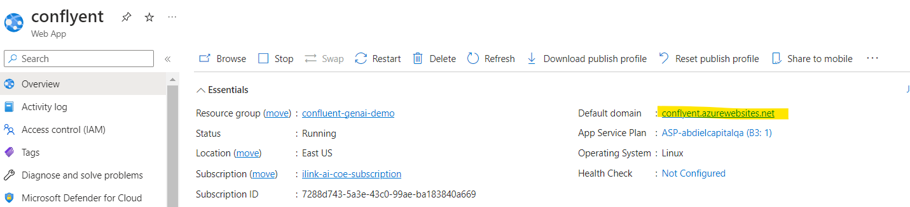

Now you can interact with the chat bot.

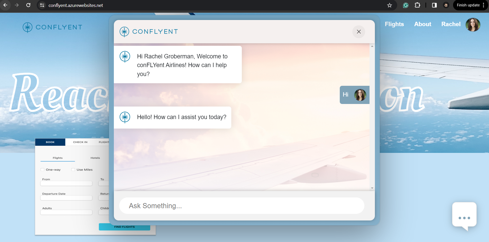

### Sample Scripts to intract with the chatbot

**Scenario 1 – Change Meal Plan**

User Question: Hi there. I want to change my meal plan for an upcoming flight

Putative Response from Bot

`To change your meal plan, I need you to confirm the flight details. Please provide me with the flight number of the upcoming flight for which you want to change the meal plan.`

Pick one of these four options

- User Response - 1: With just the flight name
- User Response - 2: First Option
- User Response - 3: First Flight

**Note:** In case the bot asks for CustomerID or something, user can always prompt it with a “You should know this” response.

Putative Response from Bot

`Thank you for confirming your flight. Can you share the meal plan that you would like to change to?`

User Response – Diabetic Meal / Veg Meal / Non-veg Meal

**Scenario 2 – Get Gate Information**

User Question - Hello. I need to confirm gate for my flight

The bot will either ask you to confirm the flight using

`Please confirm if this is the correct flight for which you would like to check the gate.`

User Response - Yes, That’s right | Yes, That’s correct | That’s correct | Yes

`The bot can also respond directly with a message, since it has the customerID, source and destination. The response will be something along the lines of:
The gate information for your flight is not available at the moment. I apologize for the inconvenience. Is there anything else I can assist you with?`

Wait for a Few Seconds. An automated message will be pushed to the chat window.

`Hi, Due to unforeseen delays at the gate, your prior flight has been redirected to board at Gate number instead. Thank you!`

**Scenario 3 – Get Weather Information**

User Question - Hello, as the weather might not be good, would like to know if everything is on schedule.

The bot will respond with:

`The weather information for your flight with details {"flight_number": "", "source_code": "", "destination_code": "", "departure_time": ""} indicates that there is a tornado warning. This might cause a delay in your flight. I recommend contacting our customer support or checking for updates on our website for more information about the status of your flight.`

Wait for a Few Seconds. An automated message will be pushed to the chat window.

`I have additional information regarding flights affected by the tornado warning. We regret to inform that your flight has been cancelled. You may reschedule your flight at no additional cost or obtain a refund in full to your payment method on file. Thank you for your understanding and patience.`

**Scenario 4 – Get Airline Policy**

User Question: Hi. Can I carry sports equipment for my flight?

The bot will respond with:

`Based on the airline policy, you are allowed to carry sports equipment for your flight. However, there are certain requirements and restrictions that you need to keep in mind:`

`The sports equipment must not exceed 165 lbs (75 kg).
It should not restrict access to emergency or regular exits or the aisle of the cabin.
It should not obscure any passenger's view of seatbelt, no smoking, or exit signs.
The equipment should not contain any prohibited or restricted items.
It should be securable with a seatbelt to avoid shifting during the flight.
The equipment should be packaged or covered safely to avoid potential injury to occupants.
It should be secured in a seat in the same cabin as the owner, preferably next to the owner.
Standard checked baggage fees apply based on cabin, travel region, and the total number of checked bags.
Overweight baggage fees apply to bags that exceed 50 lbs, and bags cannot exceed 115 linear in/292 cm (length + width + height).
Items in excess of the baggage allowance will be subject to additional fees.`

`Please note that all sports equipment must be packed in a durable protective container designed specifically for the equipment. If you have any specific questions or concerns about carrying your sports equipment, I recommend reaching out to a Conflyent gate agent when you arrive at the airport. They will assist you in checking your special item and determining if any extra fees apply.`

Let me know if there's anything else I can assist you with!

You can continue to ask it other clarifying questions

User Question: What about a large golf bag?

### Clean-up

**Approach 1:** In Azure protal Navigate to the resoruce group you created for this project and click on delete resource group to delete all the Azure components. Or use the below azure commmand to delete all the resources

````bash
az group delete --name ExampleResourceGroup
````

In Confluent cloud Navigate to the enviroment created for this project and click on Delete enviroment to delete the confluent components.

**Approach 2:** To destroy the resources created using terraform Navigate to the terraform folder present inside the blocks and run the below command.

````bash
Terraform destroy 
`````

**Note:** terraform destroy will prompt for confirmation.
