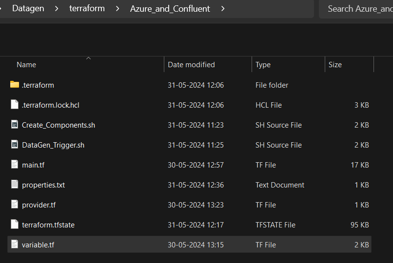
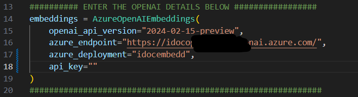

# Terraform Execution

By using terraform we are going to perform the following:

* Creation of Azure resources - Resource Group, ADLS blob, Function Apps, Container Registry, Container App and Web App.
* Creation of Confluent components - Enviroment, Cluster, Topics, Flink and Sink connector.
* Creation of DataGenration.
* Building Docker images for Frontend and Backend.
* Deploying Docker images to Container App(backend) and Web App(frontend).

## Prerequisites

1. Azure Subscription - [Azure](https://login.microsoftonline.com/organizations/oauth2/v2.0/authorize?redirect_uri=https%3A%2F%2Fportal.azure.com%2Fsignin%2Findex%2F&response_type=code%20id_token&scope=https%3A%2F%2Fmanagement.core.windows.net%2F%2Fuser_impersonation%20openid%20email%20profile&state=OpenIdConnect.AuthenticationProperties%3DHPEEzac0V84qgOTMN71ECQXxMpI5m2FqIsZ-WGWDnOrVbvpAZ3nA7huBPSk54q8UZl65nY_0rXcwOPE2MQz10cVA0PKtRLxkEER5kQ0GhZ82JuCPVt-TQdNnFpB2UO9_nQls0WPDr1R8pGE5veCZZhs9Qe5LOqQE6sY7ZEQEhYb2P0jZY_9PHvmapjpBr1_Uc8IMx6aamUMuv6sCNYhbLksp4Vw0q6foVQUSwULnWByh72Y-aacPjqRgdVFZkKVKnOa9ShbjZkJ7CtMHENAIICevhI5JDjKR86HJJKhA-9jiprU3mmnTbaU9cPcPMGsKtvAwxqt2SlZD47IBhu7_iEQmdHxA8Dy7fP4OR6tAbyiCt6UWuyVheC95EeFFYwNAOpfv1Ko2UFbOoe3Qjytb7uhHRPmncA9T69aI3suOzSlq1Lp6mE-xgCDhqxLJfFgQ_xqCDpnZ-F7vofAlwizxv3NWFb-AUaxyZwnuEF44mQsXdzPUKcK3YT62lU9O2Rvp&response_mode=form_post&nonce=638518086607887006.MWZiZjczMjMtN2Y2Ny00MTc0LThiZjMtMDAwMzMzMGM4MTViMmI4YTY0M2QtNDE0Mi00ZGMyLThhN2EtNzc1MTViNTc1NDFk&client_id=c44b4083-3bb0-49c1-b47d-974e53cbdf3c&site_id=501430&client-request-id=3e5a8f3e-366a-421f-85ee-4d6064ba4daa&x-client-SKU=ID_NET472&x-client-ver=7.2.0.0)
2. Confluent Cloud Account - [Confluent](https://www.confluent.io/confluent-cloud/?utm_medium=sem&utm_source=google&utm_campaign=ch.sem_br.brand_tp.prs_tgt.confluent-brand_mt.xct_rgn.india_lng.eng_dv.all_con.confluent-cloud&utm_term=confluent%20cloud&creative=&device=c&placement=&gad_source=1&gclid=Cj0KCQjw6auyBhDzARIsALIo6v9nBsrMlcVCFKuY5PZMkHOQ_ocpZVg9ORL-fbMQvl1Atmis7Cv2JG4aArKIEALw_wcB)
3. Rockset Account - [Rocketset](https://rockset.com/?utm_medium=paid&utm_source=google&utm_campaign=Brand_search&utm_term=rockset&utm_medium=ppc&utm_campaign=GAds-Search-Brand-US&utm_source=adwords&hsa_acc=7255809193&hsa_grp=150144081033&hsa_tgt=kwd-301988738617&hsa_src=g&hsa_ad=697473817567&hsa_mt=e&hsa_kw=rockset&hsa_net=adwords&hsa_ver=3&hsa_cam=16123169211&gad_source=1&gclid=Cj0KCQjw6auyBhDzARIsALIo6v-Q7ZTTnWnY6g6ufVM1OOznId2QBNfPXQhNiB_eqppFyJZpTZ5EXksaAgWLEALw_wcB)
4. Aure Open AI - Refere [Azure_OpenAI](Azure_OpenAI.md)
5. Terraform - [Download here](https://developer.hashicorp.com/terraform/install)
6. Azure CLI - [Download here](https://learn.microsoft.com/en-us/cli/azure/install-azure-cli)
7. Docker    - [Download here](https://www.docker.com/products/docker-desktop/)
8. Azure Function CLI - [Download here](https://learn.microsoft.com/en-us/azure/azure-functions/functions-run-local?tabs=windows%2Cisolated-process%2Cnode-v4%2Cpython-v2%2Chttp-trigger%2Ccontainer-apps&pivots=programming-language-csharp)
9. Python - Make sure you have the latest version of Python installed. If not, [download here](https://www.python.org/downloads/release/python-390/)
10. Git Bash - If not installed, [download here](https://git-scm.com/downloads)
11. Any code editor - [VS code](https://code.visualstudio.com/)

**Note:** Kindly make sure all the prerequisites are Created/Installed.

### Source Code

**Step1:** To Clone/Download the source code from the Git repository, click on `code` icon


**Step2:** In dropdown you can see options to download the code as zip or clone the repositroy.

**Step3:** Navigate to the path where the code is downloaded/cloned.


**Step4:** We are going to deploy each blocks in the below order

1. DataGen
2. FrontEnd
3. BackEnd

### DataGen

**Step1:** Open new terminal using VScode or GitBash

**Step2:** To authenticate with Azure run the below command.

````bash
Az login
````


**Note**: New window will open, kindly enter valid azure login credentials to authenticate

**Step3:** Navigate to the `DataGen -> terrform -> variable.tf`.



**Step4:** Open `Variable.tf` file and enter the required values.

**Step5:** Run `Create_Components.sh` – to create the azure and confluent components.

**Step6:** Ones `Create_Components.sh` completed. We need Place the `flight_policy_data.pdf` in the raw folder of the newly created blob container. Refere the [DataGen-Readme](./Datagen/Readme_DataGen.md) for how to place the pdf.

**Step7:** Open `properties.txt` which will be created after running `Create_Components.sh`

**Step8:** Update the `CONFLUENT_SCHEMA_REGISTRYURL` and `CONFLUENT_SCHEMA_REGISTRY_AUTH_USER` vaules. Refer [DataGen-Readme](./Datagen/Readme_DataGen.md) how to create the Schema registry.

**Step9:** Run `DataGen_Trigger.sh` – to push Data into confluent topics.

**Step10:** To create flink API key and secret, Refere [DataGen-Readme](./Datagen/Readme_DataGen.md).

**Step11:** Open `Kafka.py` and enter the OpenAI details.



**Step12:** Navigate to the `DataGen -> terrform -> Flink` folder.

**Step13:** open `variabel.tf` file and enter the requried values.

**Step14:** Run `flink.sh` to execute the flink statements and push data into embeddings topic.

### Rockset

**Note:** Refere [DataGen-Readme](./Datagen/Readme_DataGen.md) to create the Rockset intergration for confluent cluster and collection using cofluent topics.

### FrontEnd

**Step1:** Navigate to `FrontEnd -> terrform -> variable.tf`

**Step2:** Open `Variable.tf` file and enter the required values. Use the same resource group name used for DataGen.

**Step3:** Run `Frontend_deploy.sh` – To create azure components and deploy frontend.

### BackEnd

**Step1:** Navigate to `BackEnd -> chat_app -> client.properties`

**Step2:** Open `client.properties` and update the confluent cluster details.

**Step3:** Navigate to `config.py` and update the Rockset and OpenAI details.

**Step4:** Navigate to `BackEnd -> terrform -> variable.tf`

**Step5:** Open `Variable.tf` file and enter the required values. Use the same resource group name and Azure container registry name used in FrontEnd.

**Step6:** Run `Backend_deploy.sh` –To create azure components and deploy Backend.

### Clean-up

**Approach 1:** Navigate to the resoruce group you created for this project and click on delete resource group to delete all the components.

**Approach 2:** To destroy the resources created using terraform Navigate to the terraform folder present inside the blocks and run the below command.

````bash
Terraform destroy 
`````

**Note:** terraform destroy will prompt for confirmation.
